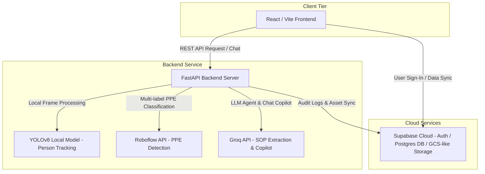

# SafeGuard AI: Workplace Safety & Compliance Intelligence Platform

SafeGuard AI is an enterprise-grade safety intelligence platform that automates workplace PPE audit compliance and risk assessment using a multi-agent computer vision and LLM reasoning pipeline.

By combining real-time CCTV or camera feed tracking (YOLOv8 + Roboflow) with LLM-parsed Standard Operating Procedures (SOPs via Groq), the platform continuously audits work zones, assigns persistent tracking identities to workers, calculates localized risk scores, and hosts an interactive safety copilot for compliance officers.

---

## 🚀 Features

- **Standard Operating Procedure Ingestion**: Drag-and-drop SOP PDFs are automatically parsed by a document ingestion agent, extracting required PPE types by zone, role, or activity.
- **Persistent Temporal Worker Tracking**: Custom centroid fallback and IoU temporal tracking resolves the "id-switching" problem, maintaining consistent worker identities (e.g., Worker #01, Worker #02) across occlusion and camera frame entries.
- **Multi-Label PPE Detection**: Detects helmets, goggles, high-visibility vests, gloves, masks, and safety shoes in real-time.
- **SOP Compliance Audit & Risk Engine**: Automatically maps frame-by-frame PPE detections to SOP constraints, tracking duration of violations and calculating a dynamic workspace risk index.
- **Safety Copilot AI & Decision Traces**: Interactive natural language copilot backed by LLM reasoning allowing compliance officers to query details of safety exceptions with source citations.
- **Automated PDF Audits**: Generates publication-ready, clean PDF compliance reports with ASCII safety symbols and tables.
- **Aesthetic Walkthrough Screen**: Dynamic interactive tour dashboard built directly into the login screen to demonstrate the pipeline structure.

---

## 🏗️ Architecture

The platform follows a modern full-stack decoupled architecture:



---

## 🛠️ Tech Stack

### Frontend
- **Framework**: React.js v19 (Vite)
- **Styling**: Tailwind CSS (Vanilla utilities, custom glassmorphic properties)
- **Icons**: Lucide React
- **Hosting**: Vercel

### Backend
- **Framework**: FastAPI (Python 3.10+)
- **Inference**: YOLOv8 (Ultralytics) & Roboflow API
- **LLM Engine**: Groq SDK (Llama-3-70b/8b)
- **PDF Generation**: ReportLab
- **Hosting**: Render

### Database & Security
- **Auth & Storage**: Supabase Auth and Supabase Storage (video uploads)
- **Database**: PostgreSQL (Supabase Cloud)

---

## 📂 Project Structure

```
.
├── backend/
│   ├── app/
│   │   ├── api/            # API Endpoints (auth, audit, stats, copilot)
│   │   ├── core/           # Configuration & security
│   │   ├── models/         # Database models / schemas
│   │   ├── services/       # AI pipeline, tracking, pdf generation
│   │   ├── temp/           # Runtime temporary folder (gitignored)
│   │   └── main.py         # Application entry point
│   ├── requirements.txt    # Python dependencies
│   ├── Dockerfile          # Container config
│   └── yolov8n.pt          # Local person detection model
├── frontend/
│   ├── src/
│   │   ├── components/     # UI elements
│   │   ├── context/        # React global state (Auth, Project)
│   │   ├── pages/          # Core pages (Dashboard, Auth, Copilot, Audit)
│   │   └── App.jsx         # Client routing
│   ├── index.html          # HTML Entry
│   ├── package.json        # Frontend dependencies
│   └── tailwind.config.js  # Styling guidelines
├── supabase/
│   └── migrations/         # PostgreSQL schema definition migrations
├── render.yaml             # Render deployment blueprint
├── .gitignore              # Global git exclusions
└── README.md               # Project documentation
```

---

## ⚙️ Environment Variables

### Backend (`backend/.env`)
Create a `.env` file in `/backend` with:
```env
SUPABASE_URL=https://your-supabase-project.supabase.co
SUPABASE_KEY=your-supabase-service-role-key
GROQ_API_KEY=gsk_your-groq-key
ROBOFLOW_API_KEY=your-roboflow-key
```

### Frontend (`frontend/.env`)
Create a `.env` file in `/frontend` with:
```env
VITE_SUPABASE_URL=https://your-supabase-project.supabase.co
VITE_SUPABASE_ANON_KEY=your-supabase-anon-key
```

---

## 🚀 Setup & Installation

### 1. Database Setup (Supabase)
1. Register/Login to [Supabase](https://supabase.com).
2. Create a new project.
3. Open the **SQL Editor** in Supabase and paste the contents of `supabase/migrations/00000000000000_initial_schema.sql` to initialize the tables, permissions, and storage buckets.
4. Go to **Project Settings > API** to retrieve your keys.

### 2. Backend Setup
1. Open a terminal and navigate to the backend directory:
   ```bash
   cd backend
   ```
2. Initialize and activate a virtual environment:
   ```bash
   python -m venv venv
   # On Windows:
   .\venv\Scripts\activate
   # On Unix/macOS:
   source venv/bin/activate
   ```
3. Install dependencies:
   ```bash
   pip install -r requirements.txt
   ```
4. Configure `.env` using your variables.
5. Start the FastAPI development server:
   ```bash
   uvicorn app.main:app --host 127.0.0.1 --port 8000 --reload
   ```

### 3. Frontend Setup
1. Open a new terminal and navigate to the frontend directory:
   ```bash
   cd frontend
   ```
2. Install npm modules:
   ```bash
   npm install
   ```
3. Configure `.env` with your Supabase Anon keys.
4. Start the Vite React development server:
   ```bash
   npm run dev
   ```
5. Open your browser to `http://localhost:5173`.

---

## 🤖 AI Ingestion Pipeline Overview

1. **Rule Parsing**: Document Agent reads safety SOPs using Groq, extracting JSON structured requirements.
2. **Inference (YOLOv8)**: Local YOLOv8 person detection extracts bounding boxes of physical workers.
3. **Temporal Tracking**: Tracks are matched across frames using IoU (Intersection-over-Union) with a `0.4` threshold, centroid fallback distance, and an 8-frame track pruning age.
4. **PPE Verification**: Bounding boxes are cropped and analyzed via Roboflow's custom multi-label PPE model.
5. **Auditing**: Audit Agent aligns detections against SOP rules. Non-compliant durations are registered, and localized risk scores are generated.

---

## 📺 Demo Video & Screenshots

### Interactive Walkthrough Tour
*Click the "How It Works" button on the Sign-In screen to view the tour.*


### Video Walkthrough
*Demo video link placeholder: [SafeGuard AI System Demo](https://youtube.com/placeholder)*

---

## 🚢 Deployment Instructions

### Frontend (Vercel)
1. Install Vercel CLI or link your repository to GitHub.
2. Deploy the `frontend/` directory to Vercel.
3. Add `VITE_SUPABASE_URL` and `VITE_SUPABASE_ANON_KEY` to Vercel Environment Variables.

### Backend (Render)
The project includes a `render.yaml` blueprint:
1. Connect your GitHub repository to Render.
2. Deploy using the blueprint `render.yaml` or create a Web Service using the `backend/Dockerfile`.
3. Add the backend Environment Variables to Render.
