<div align="center">


# SentinelAI

### Workplace Safety & Compliance Intelligence Platform

*An enterprise-grade, multi-agent AI system for real-time PPE compliance auditing, risk assessment, and safety intelligence — powered by computer vision, RAG, and LLM reasoning.*

---

[](https://python.org)
[](https://fastapi.tiangolo.com)
[](https://react.dev)
[](https://supabase.com)
[](https://ultralytics.com)
[](https://groq.com)
[](https://github.com/pgvector/pgvector)
[](https://github.com)
[](https://modelcontextprotocol.io)
[](LICENSE)

</div>

---

## 📋 Table of Contents

- [Overview](#-overview)
- [System Architecture](#️-system-architecture)
- [End-to-End Pipeline](#-end-to-end-pipeline)
- [Multi-Agent AI System](#-multi-agent-ai-system)
- [RAG Pipeline](#-rag-pipeline)
- [AI Components Explained](#-ai-components-explained)
- [Tech Stack](#-tech-stack)
- [Database Schema](#-database-schema)
- [AI Decision Flow](#-ai-decision-flow)
- [Explainable AI](#-explainable-ai)
- [Sequence Diagram](#-sequence-diagram)
- [Key Features](#-key-features)
- [Why Agentic AI?](#-why-agentic-ai)
- [Design Principles](#-design-principles)
- [Project Structure](#-project-structure)
- [Environment Variables](#️-environment-variables)
- [Setup & Installation](#-setup--installation)
- [API Overview](#-api-overview)
- [Agent Responsibilities](#-agent-responsibilities)
- [Deployment Architecture](#-deployment-architecture)
- [Future Roadmap](#-future-roadmap)
- [License](#-license)

---

## 🌟 Overview

SentinelAI transforms workplace safety compliance from a reactive, manual process into a **proactive, autonomous AI operation**. Upload a workplace video, and a fleet of specialized AI agents — coordinated by a central orchestrator — analyze every frame, cross-reference your SOPs, identify violations, assess risk, and generate a publication-ready audit report.

> **Built for compliance officers, safety managers, and industrial operations teams who need real-time, explainable AI — not just another detection model.**

### What makes SentinelAI different?

| Capability | Traditional CCTV Systems | SentinelAI |
|---|---|---|
| PPE Detection | ✅ Basic bounding boxes | ✅ Multi-label + confidence |
| SOP Awareness | ❌ No rule context | ✅ RAG-grounded SOP compliance |
| Worker Identity | ❌ No tracking | ✅ Persistent cross-frame IDs |
| Explainability | ❌ Black box | ✅ Factor decomposition + citations |
| Reporting | ❌ Manual | ✅ Auto-generated PDF audit reports |
| Human Review | ❌ None | ✅ HITL approval workflow |
| AI Agents | ❌ Single model | ✅ 6 specialized coordinated agents |
| Speech | ❌ Silent | ✅ Whisper audio transcription |

---

## 🏗️ System Architecture

The platform is organized into four tiers: **Client**, **Backend**, **AI Agent Layer**, and **Data**. Every component communicates through well-defined interfaces.

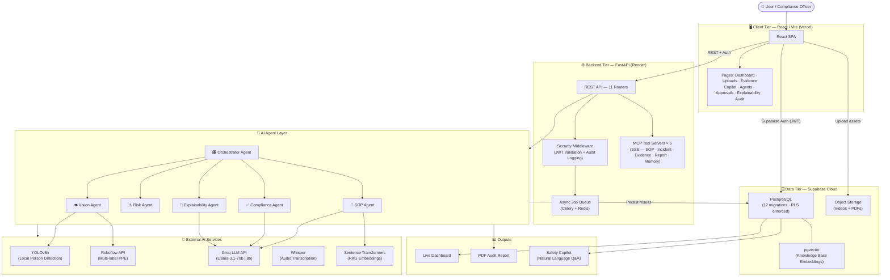

---

## 🔄 End-to-End Pipeline

Every video submitted travels through a deterministic, multi-stage pipeline before results appear in the dashboard.

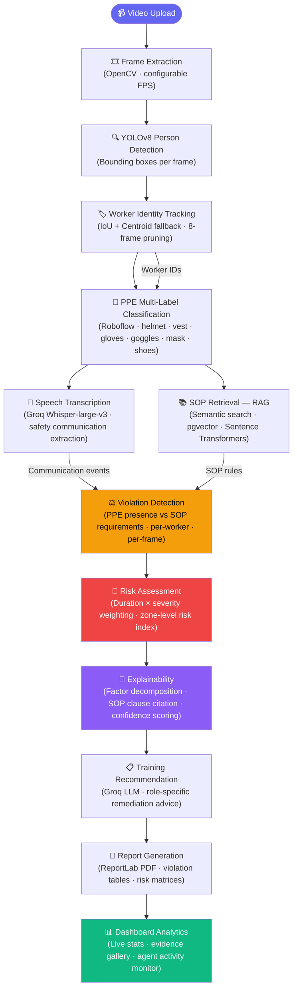

---

## 🤖 Multi-Agent AI System

SentinelAI uses a **sequential orchestration pattern** — a central Orchestrator delegates subtasks to specialized agents, each with a defined input contract and output schema.

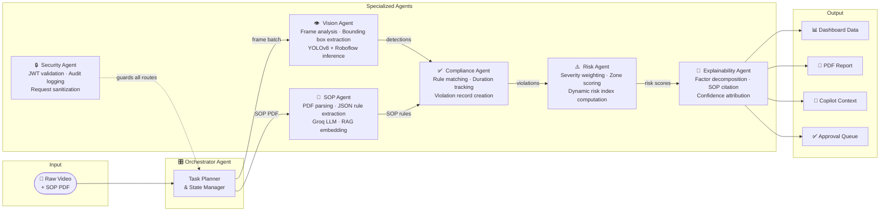

### Agent Communication Protocol

All agents implement a shared `BaseAgent` contract:

```python
# Every agent exposes this interface
class BaseAgent:
    name: str            # Agent identifier
    description: str     # Capability declaration
    inputs: dict         # Typed input schema
    outputs: dict        # Typed output schema

    async def run(self, state: WorkflowState) -> AgentResult: ...
    async def validate(self, inputs: dict) -> bool: ...
    def log_trace(self, step: str, data: dict): ...
```

---

## 📚 RAG Pipeline

SentinelAI's Safety Copilot and violation audit are grounded in your organization's actual SOP documents — not generic rules — using a full **Retrieval-Augmented Generation** pipeline.

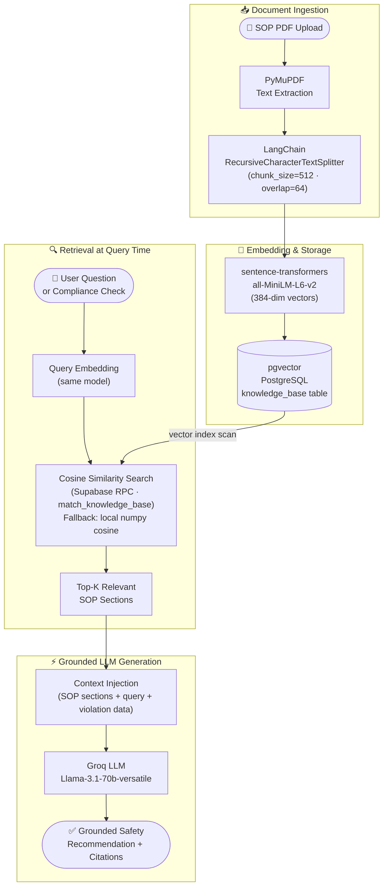

> **Why RAG over fine-tuning?** RAG ensures the LLM always uses *your* SOPs as the authoritative source, preventing hallucination of safety rules. SOP updates take effect immediately — no model retraining required.

---

## 🔬 AI Components Explained

<details>
<summary><strong>🖥️ Computer Vision Layer</strong></summary>

### YOLOv8 Person Detection
- **Model**: `yolov8n.pt` (nano variant for CPU-efficient inference)
- **Task**: Detects and localizes all persons in each video frame
- **Output**: Bounding boxes `[x1, y1, x2, y2]` with confidence scores
- **Threshold**: Configurable confidence cutoff (default `0.4`)

### Temporal Consistency & Worker Tracking
- **Algorithm**: IoU-based frame-to-frame matching with centroid distance fallback
- **IoU Threshold**: `0.4` — boxes with overlap > 40% are considered the same worker
- **Fallback**: When IoU fails (occlusion), nearest centroid within 80px is matched
- **Track Pruning**: Tracks absent for > 8 consecutive frames are retired
- **Result**: Persistent Worker IDs (Worker #01, #02, ...) survive occlusion and re-entry

### Multi-Label PPE Classification (Roboflow)
- **Model**: Custom Roboflow workspace model trained on industrial PPE datasets
- **Labels**: `helmet`, `safety-vest`, `gloves`, `goggles`, `mask`, `safety-shoes`
- **Input**: Cropped worker bounding box (per-person, per-frame)
- **Output**: Multi-hot confidence vector per PPE class
- **Integration**: Roboflow Inference SDK (`inference-sdk`)

</details>

<details>
<summary><strong>🎤 Speech Intelligence</strong></summary>

### Whisper Audio Transcription
- **Model**: `whisper-large-v3` via Groq API
- **Format**: `verbose_json` — returns transcript text + timestamp segments
- **Use Case**: Extracts safety warnings, commands, and communications from video audio

### Safety Communication Analysis
- **Pipeline**: Transcript → Groq Llama-3.1-8b → Structured JSON
- **Output schema**: `[{type: "warning|command|instruction", quote: "...", severity: "low|medium|high"}]`
- **Integration**: Results attached to video analysis record alongside visual detections

</details>

<details>
<summary><strong>📚 Retrieval-Augmented Generation</strong></summary>

### Embedding Model
- **Model**: `sentence-transformers/all-MiniLM-L6-v2`
- **Dimensions**: 384
- **Lazy-loaded**: Model instantiates only when first needed to avoid blocking startup
- **Chunking**: `RecursiveCharacterTextSplitter` with `chunk_size=512`, `chunk_overlap=64`

### Vector Search
- **Primary**: Supabase RPC `match_knowledge_base` (pgvector cosine similarity)
- **Fallback**: Local NumPy cosine similarity over fetched rows (network resilience)
- **Scope**: All searches are scoped to `project_id` + `user_id` for data isolation
- **Top-K**: Configurable, default top-5 most relevant SOP sections

### Context Injection
- Retrieved SOP sections are prepended to the LLM prompt as grounding context
- Source citations (section title, confidence, page) are preserved in the response

</details>

<details>
<summary><strong>🤖 Multi-Agent Reasoning</strong></summary>

### Sequential Planning
The Orchestrator Agent decomposes each job into a deterministic task graph, executing agents in dependency order: Vision → SOP (parallel) → Compliance → Risk → Explainability.

### Tool Calling via MCP
Five SSE-based Model Context Protocol servers expose platform data as callable tools, enabling external AI systems to query SOP rules, retrieve incidents, access evidence, and generate reports programmatically.

### Evidence Sharing
All agents write to and read from a shared `WorkflowState` object (Pydantic model), passed through the pipeline. No agent holds private state — all outputs are inspectable and auditable.

### Fault Isolation
Each agent wraps its execution in a try/except boundary. A failing agent records an error state and the orchestrator continues with graceful degradation, rather than failing the entire pipeline.

</details>

<details>
<summary><strong>🧠 Explainability Engine</strong></summary>

### Factor Decomposition
Every risk score is broken into weighted contributing factors:
- PPE violation type × severity weight
- Violation duration (frames × FPS)
- Zone criticality multiplier
- SOP coverage gap

### Confidence Attribution
Each violation finding includes a confidence score derived from:
- Roboflow detection confidence
- IoU tracking stability score
- SOP clause match specificity (from RAG similarity score)

### Human-in-the-Loop
Officers can accept, reject, or annotate AI findings through the Approvals interface. All decisions are persisted to `hitl_approvals` with timestamps, creating an auditable decision trail.

</details>

---

## 🛠️ Tech Stack

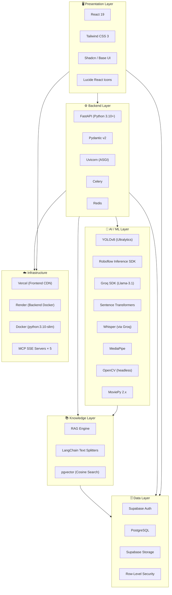

---

## 🗄️ Database Schema

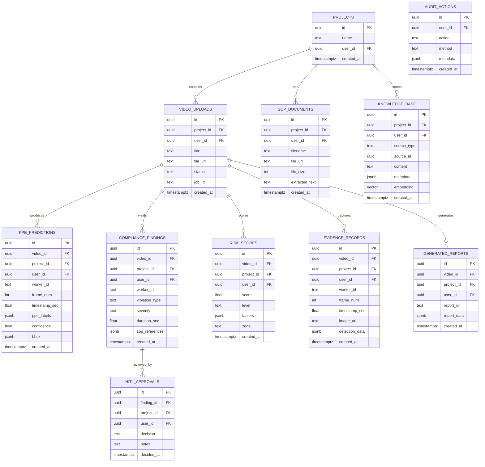

---

## 🎯 AI Decision Flow

Trace how a single detected violation becomes an explainable, actionable recommendation:

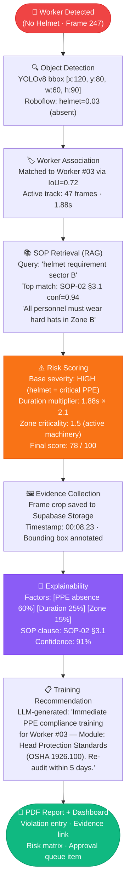

---

## 🧠 Explainable AI

Every AI decision in SentinelAI is fully auditable. The Explainability module ensures compliance officers understand *why* a risk score was generated, not just *what* it is.

### Anatomy of an Explainability Record

```
┌──────────────────────────────────────────────────────────────────┐
│  ⚠️  VIOLATION RECORD  #V-2024-0847                             │
├──────────────────────────────────────────────────────────────────┤
│  Worker        │ Worker #03  (track ID: t-47)                   │
│  Violation     │ Missing: Hard Hat (helmet)                      │
│  Zone          │ Sector B — Active Machinery                     │
│  Timestamp     │ 00:08.23 — 00:10.11  (1.88 seconds)            │
│  Confidence    │ 91.4%                                           │
├──────────────────────────────────────────────────────────────────┤
│  📄 SOP CLAUSE VIOLATED                                          │
│  SOP-02 §3.1: "All personnel must wear approved hard hats       │
│  at all times when working in or passing through Zone B          │
│  (Active Machinery). No exceptions."                             │
│  RAG match confidence: 94.1%                                     │
├──────────────────────────────────────────────────────────────────┤
│  📊 RISK FACTOR DECOMPOSITION              Score: 78 / 100      │
│  ▓▓▓▓▓▓▓▓▓▓▓▓░░░░░░░░  PPE Absence (60%)                       │
│  ▓▓▓▓▓░░░░░░░░░░░░░░░░  Exposure Duration (25%)                 │
│  ▓▓░░░░░░░░░░░░░░░░░░░  Zone Criticality (15%)                  │
├──────────────────────────────────────────────────────────────────┤
│  🖼️  EVIDENCE                                                    │
│  Frame #247  |  Bounding box annotated  |  Stored in cloud      │
├──────────────────────────────────────────────────────────────────┤
│  📋 RECOMMENDATION                                               │
│  Immediate: Issue PPE to Worker #03 before re-entry to Zone B   │
│  Training: Head Protection Standards — OSHA 1926.100            │
│  Re-audit: Within 5 working days                                 │
│  Follow-up: Supervisor sign-off required                        │
└──────────────────────────────────────────────────────────────────┘
```

---

## 🔗 Sequence Diagram

Full request lifecycle from video upload through dashboard display:

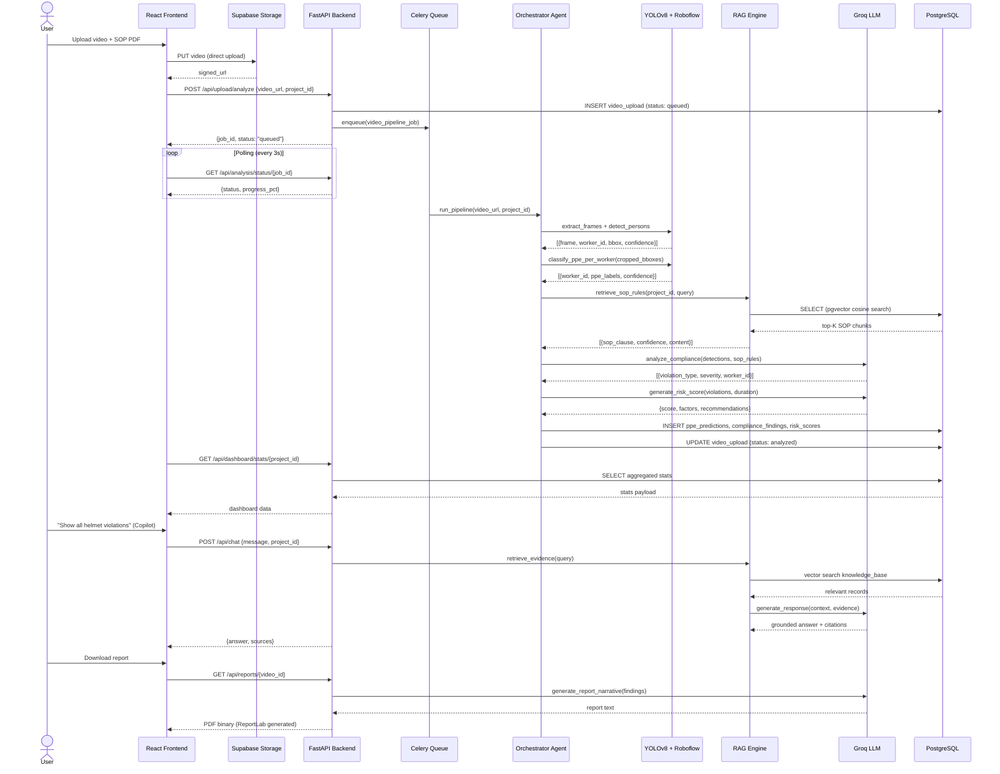

---

## ✨ Key Features

| | Feature | Description |
|---|---|---|
| 🦺 | **PPE Detection** | Multi-label real-time detection: helmet · vest · gloves · goggles · mask · shoes via Roboflow custom model |
| 📄 | **SOP Intelligence** | RAG-grounded compliance: upload any SOP PDF and violations are checked against *your* rules |
| 🏷️ | **Worker Tracking** | Persistent cross-frame identities using IoU + centroid matching — survives occlusion |
| 🎤 | **Speech Analysis** | Whisper-large-v3 audio transcription with safety communication extraction |
| 📈 | **Risk Prediction** | Dynamic risk index: duration × severity × zone criticality → actionable scores |
| 🧠 | **Explainability** | Every score decomposed into human-readable contributing factors with SOP citations |
| 📊 | **Dashboard** | Live compliance stats, violation timelines, worker risk profiles, analytics |
| 🤖 | **Multi-Agent AI** | 6 specialized coordinated agents: SOP · Vision · Risk · Compliance · Explainability · Security |
| 📚 | **Knowledge Base** | pgvector-powered RAG store with per-project SOP isolation and cosine semantic search |
| 📑 | **Report Generator** | One-click PDF audit reports with violation tables, risk matrices, recommendations |
| ✅ | **HITL Approvals** | Human-in-the-loop review workflow — approve/reject AI alerts with audit trail |
| 🔍 | **Evidence Gallery** | Frame-level violation evidence with bounding box annotations and timestamps |
| 🤖 | **Safety Copilot** | Natural language Q&A interface with RAG-cited source evidence |
| ⚡ | **Agent Monitor** | Real-time view of all 6 agents — inputs, outputs, status, timing |
| 🔌 | **MCP Servers** | 5 SSE-based Model Context Protocol tool servers for external AI integrations |

---

## 🤔 Why Agentic AI?

> A single LLM cannot reliably perform computer vision, temporal tracking, semantic search, risk computation, and structured report generation simultaneously. Specialized agents can.

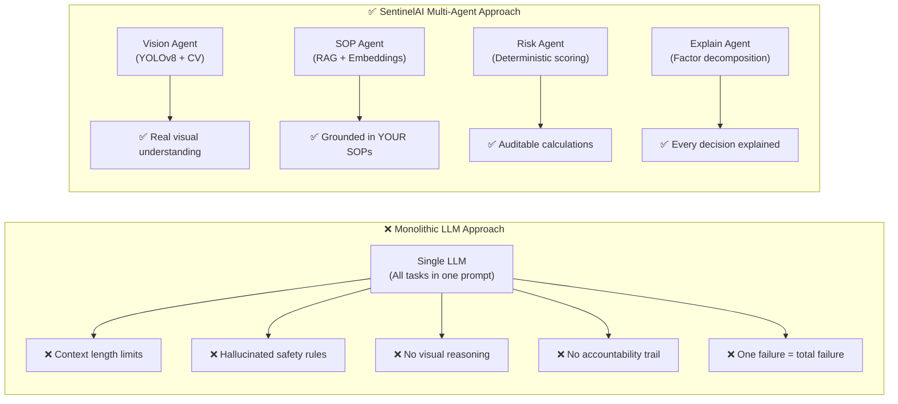

| Principle | How SentinelAI applies it |
|---|---|
| **Planning** | Orchestrator builds a deterministic task graph per job |
| **Tool Calling** | Agents invoke YOLOv8, Roboflow, Groq, pgvector as typed tools |
| **Delegation** | Each agent owns exactly one domain — no cross-contamination |
| **Shared Memory** | `WorkflowState` passed through pipeline; all agents read/write |
| **Context Sharing** | Evidence from Vision Agent flows directly into Compliance Agent |
| **Explainability** | Dedicated Explainability Agent — not an afterthought |
| **Modular Reasoning** | Swap any agent's model without rebuilding the pipeline |
| **Fault Isolation** | Failed agent logs error state; orchestrator continues gracefully |
| **Parallel Processing** | Vision and SOP ingestion can run concurrently on separate workers |

---

## 🎨 Design Principles

> SentinelAI is designed around five core engineering principles:

1. **Grounding over Hallucination** — Every AI claim is backed by RAG-retrieved SOP text or video evidence. The system refuses to invent safety rules.

2. **Explainability by Default** — No black-box scores. Every risk index includes a factor decomposition viewable by the compliance officer.

3. **Human Authority** — AI recommends; humans decide. The HITL approval workflow ensures no automated enforcement without human sign-off.

4. **Strict Data Isolation** — Row-Level Security at the PostgreSQL layer enforces per-user project scoping. No data leaks across tenants.

5. **Graceful Degradation** — Each agent wraps execution in fault boundaries. A Roboflow API timeout degrades to best-effort PPE detection, not a pipeline failure.

---

## 📂 Project Structure

```
SentinelAI-Safety-Intelligence-Platform/
│
├── 📁 backend/                        # FastAPI backend service
│   ├── 📁 app/
│   │   ├── 📁 agents/                 # Multi-agent AI system
│   │   │   ├── base.py                # BaseAgent contract (shared interface)
│   │   │   ├── orchestrator_agent.py  # Task planner & state manager
│   │   │   ├── sop_agent.py           # SOP parsing & knowledge extraction
│   │   │   ├── vision_agent.py        # Frame analysis coordination
│   │   │   ├── compliance_agent.py    # Rule matching & violation detection
│   │   │   ├── risk_agent.py          # Risk scoring & zone analysis
│   │   │   ├── explainability_agent.py# Factor decomposition & attribution
│   │   │   └── security_agent.py      # JWT validation & audit logging
│   │   │
│   │   ├── 📁 api/                    # REST API endpoints (FastAPI routers)
│   │   │   ├── dashboard.py           # Aggregated stats & KPIs
│   │   │   ├── upload.py              # Video + SOP upload & job dispatch
│   │   │   ├── analysis.py            # Pipeline status & results
│   │   │   ├── chat.py                # Safety Copilot (RAG + LLM)
│   │   │   ├── reports.py             # PDF report generation (ReportLab)
│   │   │   ├── approvals.py           # HITL approval workflow
│   │   │   ├── agents.py              # Agent invocation endpoints
│   │   │   ├── evidence.py            # Evidence record retrieval
│   │   │   ├── insights.py            # Training recommendations
│   │   │   ├── audit.py               # Security audit trail
│   │   │   └── demo.py                # Demo data seeding & reset
│   │   │
│   │   ├── 📁 core/                   # Shared configuration
│   │   │   ├── config.py              # Pydantic Settings (env vars)
│   │   │   ├── supabase_client.py     # Supabase client singleton
│   │   │   └── celery_app.py          # Celery + Redis configuration
│   │   │
│   │   ├── 📁 mcp/                    # MCP SSE Tool Servers
│   │   │   ├── sop_server.py          # SOP query tool server
│   │   │   ├── incident_server.py     # Incident retrieval tool server
│   │   │   ├── evidence_server.py     # Evidence access tool server
│   │   │   ├── reporting_server.py    # Report generation tool server
│   │   │   ├── memory_server.py       # Context memory tool server
│   │   │   └── sse_transport.py       # SSE protocol transport layer
│   │   │
│   │   ├── 📁 models/                 # Pydantic request/response schemas
│   │   │
│   │   ├── 📁 services/               # Core AI & business logic
│   │   │   ├── video_pipeline.py      # End-to-end pipeline orchestration (~67KB)
│   │   │   ├── temporal_tracker.py    # IoU + centroid worker tracking
│   │   │   ├── yolov8_service.py      # Person detection wrapper
│   │   │   ├── roboflow_service.py    # PPE classification wrapper
│   │   │   ├── groq_service.py        # LLM reasoning & report generation
│   │   │   ├── rag_service.py         # Embedding, storage, retrieval
│   │   │   ├── sop_service.py         # SOP parsing & rule extraction
│   │   │   ├── risk_service.py        # Risk computation engine
│   │   │   ├── compliance_service.py  # Violation rule matching
│   │   │   ├── analytics_service.py   # Dashboard aggregation
│   │   │   ├── report_service.py      # PDF structure & layout
│   │   │   ├── whisper_service.py     # Audio transcription
│   │   │   ├── pii_service.py         # PII detection & redaction
│   │   │   ├── timeline_service.py    # Violation timeline construction
│   │   │   └── sop_sequence_validator.py # SOP sequence constraint checking
│   │   │
│   │   └── main.py                    # FastAPI app, CORS, middleware, routers
│   │
│   ├── 📁 scripts/                    # Development & diagnostic utilities
│   │   ├── test_all_endpoints.py      # Full endpoint smoke test suite
│   │   ├── test_e2e.py                # End-to-end pipeline test
│   │   ├── check_db.py                # Database connectivity checker
│   │   └── ...                        # 20 additional diagnostic scripts
│   │
│   ├── requirements.txt               # Python dependencies (pinned)
│   ├── .env.example                   # Environment variable template
│   ├── Dockerfile                     # Container (python:3.10-slim)
│   └── yolov8n.pt                     # Local person detection model weights
│
├── 📁 frontend/                       # React/Vite SPA
│   ├── 📁 src/
│   │   ├── 📁 components/             # Shared UI components
│   │   │   └── ProtectedRoute.jsx     # Auth-guarded route wrapper
│   │   ├── 📁 context/
│   │   │   └── ActiveProjectContext.jsx # Global project + polling state
│   │   ├── 📁 lib/
│   │   │   ├── supabase.js            # Supabase client configuration
│   │   │   ├── auth.js                # Auth helpers + demo session
│   │   │   ├── constants.js           # API_URL and shared constants
│   │   │   ├── project.js             # Project CRUD helpers
│   │   │   └── demoData.js            # Demo mode data loader
│   │   ├── 📁 pages/
│   │   │   ├── Auth.jsx               # Login + signup + walkthrough tour
│   │   │   ├── Dashboard.jsx          # KPIs · violations · risk overview
│   │   │   ├── Uploads.jsx            # Video + SOP upload interface
│   │   │   ├── AnalysisViewer.jsx     # Per-video analysis results
│   │   │   ├── EvidenceGallery.jsx    # Frame-level evidence browser
│   │   │   ├── SafetyCopilot.jsx      # Natural language AI Q&A
│   │   │   ├── AgentActivityViewer.jsx# Real-time agent status monitor
│   │   │   ├── Approvals.jsx          # HITL approval workflow
│   │   │   ├── Explainability.jsx     # Risk factor decomposition view
│   │   │   └── AuditLogs.jsx          # Security action audit trail
│   │   └── App.jsx                    # Router + sidebar + auth flow
│   ├── 📁 public/
│   │   ├── favicon.svg                # SentinelAI logo
│   │   └── walkthrough_mockup.png     # Pipeline tour screenshot
│   ├── .env.example                   # Frontend environment template
│   ├── package.json                   # npm dependencies
│   └── tailwind.config.js             # Tailwind + glassmorphic config
│
├── 📁 supabase/
│   └── 📁 migrations/                 # 12 ordered PostgreSQL migrations
│       ├── 00000000000000_initial_schema.sql
│       ├── ...
│       └── 00000000000011_fix_rls_and_service_role.sql
│
├── LICENSE                            # MIT License
├── render.yaml                        # Render deployment blueprint
├── vercel.json                        # Vercel SPA routing rewrites
└── README.md                          # This document
```

---

## 🏗️ Architecture

The platform follows a modern full-stack decoupled architecture:

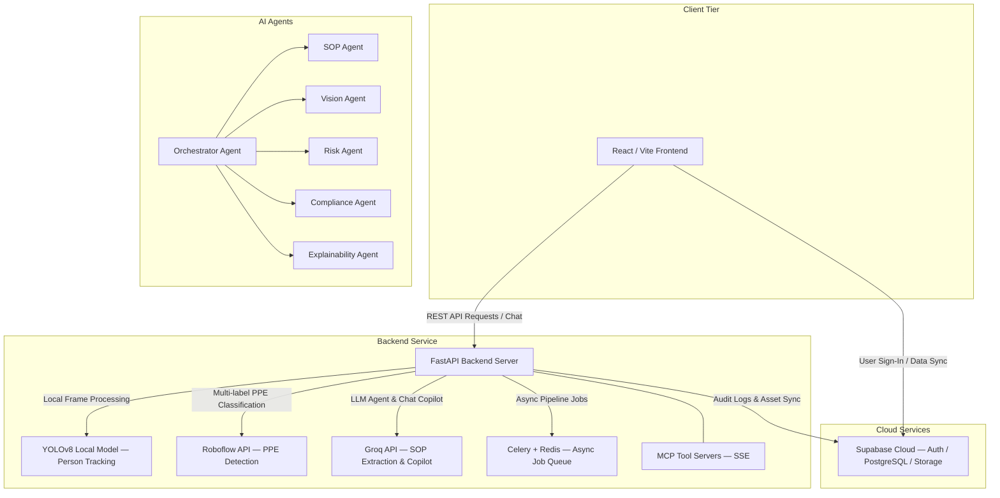

---

## ⚙️ Environment Variables

### Backend (`backend/.env`)
Copy `backend/.env.example` to `backend/.env`:

```env
# Supabase
SUPABASE_URL=https://your-project.supabase.co
SUPABASE_SECRET_KEY=your-supabase-service-role-key

# AI / Inference APIs
GROQ_API_KEY=gsk_your-groq-key
ROBOFLOW_API_KEY=your-roboflow-key

# Optional: Google Gemini
GEMINI_API_KEY=your-gemini-key
```

### Frontend (`frontend/.env`)
Copy `frontend/.env.example` to `frontend/.env`:

```env
VITE_SUPABASE_URL=https://your-project.supabase.co
VITE_SUPABASE_PUBLISHABLE_KEY=your-supabase-anon-key
VITE_API_URL=http://localhost:8000
```

> **Security**: Never commit `.env` files. Both are listed in `.gitignore`.

---

## 🚀 Setup & Installation

### Prerequisites

| Requirement | Version | Notes |
|---|---|---|
| Python | 3.10+ | Used for backend + AI inference |
| Node.js | 18+ | Used for frontend |
| Supabase account | Free | Project + API keys needed |
| Groq API key | Free | [console.groq.com](https://console.groq.com) |
| Roboflow API key | Free | [roboflow.com](https://roboflow.com) |

### 1. Database Setup (Supabase)

```bash
# 1. Create a new Supabase project at https://supabase.com
# 2. Open SQL Editor and run migrations in order:
#    supabase/migrations/00000000000000_initial_schema.sql
#    supabase/migrations/00000000000001_phase3_rag.sql
#    ... through ...
#    supabase/migrations/00000000000011_fix_rls_and_service_role.sql
# 3. Retrieve URL, anon key, and service_role key from Project Settings → API
```

### 2. Backend Setup

```bash
cd backend

# Create and activate virtual environment
python -m venv venv
.\venv\Scripts\activate          # Windows
# source venv/bin/activate       # macOS / Linux

# Install all dependencies
pip install -r requirements.txt

# Configure environment
cp .env.example .env
# Edit .env with your real API keys

# Start the development server
uvicorn app.main:app --host 127.0.0.1 --port 8000 --reload

# Visit http://localhost:8000/docs for interactive Swagger UI
# Visit http://localhost:8000/health to confirm backend is live
```

### 3. Frontend Setup

```bash
cd frontend

# Install dependencies
npm install

# Configure environment
cp .env.example .env
# Set VITE_SUPABASE_URL, VITE_SUPABASE_PUBLISHABLE_KEY, VITE_API_URL

# Start the development server
npm run dev

# Open http://localhost:5173
```

---

## 🌐 API Overview

<details>
<summary><strong>View full API endpoint reference</strong></summary>

| Method | Endpoint | Description | Auth |
|---|---|---|---|
| `GET` | `/health` | Liveness check | None |
| `GET` | `/docs` | Interactive Swagger UI | None |
| **Dashboard** | | | |
| `GET` | `/api/dashboard/stats` | Aggregated KPIs (violations, compliance %, risk) | JWT |
| `GET` | `/api/dashboard/violations` | Recent violation records | JWT |
| `GET` | `/api/dashboard/predictions` | PPE prediction results | JWT |
| **Upload** | | | |
| `POST` | `/api/upload/video` | Upload video to Supabase Storage | JWT |
| `POST` | `/api/upload/sop` | Upload + parse SOP PDF | JWT |
| `POST` | `/api/upload/analyze` | Trigger video analysis pipeline | JWT |
| **Analysis** | | | |
| `GET` | `/api/analysis/status/{job_id}` | Check pipeline job status | JWT |
| `GET` | `/api/analysis/results/{video_id}` | Fetch full analysis results | JWT |
| **Chat (Copilot)** | | | |
| `POST` | `/api/chat` | RAG-grounded Safety Copilot query | JWT |
| **Reports** | | | |
| `GET` | `/api/reports/{video_id}` | Generate + return PDF report | JWT |
| **Agents** | | | |
| `POST` | `/api/agents/observation` | Run observation agent | JWT* |
| `POST` | `/api/agents/compliance` | Run compliance agent | JWT* |
| `POST` | `/api/agents/risk` | Run risk agent | JWT* |
| **Approvals** | | | |
| `GET` | `/api/approvals` | Fetch pending HITL items | JWT |
| `POST` | `/api/approvals/{id}/decide` | Submit approval decision | JWT |
| **Audit** | | | |
| `GET` | `/api/audit/logs` | Security audit trail | JWT |
| **Demo** | | | |
| `POST` | `/api/demo/load` | Seed pre-built demo dataset | None |
| `POST` | `/api/demo/reset` | Clear demo data | None |
| **MCP** | | | |
| `GET` | `/api/mcp/sop/sse` | SOP tool server (SSE) | None |
| `GET` | `/api/mcp/incident/sse` | Incident tool server (SSE) | None |
| `GET` | `/api/mcp/evidence/sse` | Evidence tool server (SSE) | None |
| `GET` | `/api/mcp/reporting/sse` | Reporting tool server (SSE) | None |
| `GET` | `/api/mcp/memory/sse` | Memory tool server (SSE) | None |

> *JWT* = requires Supabase JWT in `Authorization` header

</details>

---

## 🤖 Agent Responsibilities

| Agent | Owns | Inputs | Outputs |
|---|---|---|---|
| **Orchestrator** | Task graph, state routing | Raw job spec | Ordered task list |
| **SOP Agent** | Rule extraction, RAG embedding | PDF bytes | JSON SOP rules + embeddings |
| **Vision Agent** | Person detection, PPE labeling | Video frames | `[{worker_id, frame, ppe_labels, bbox}]` |
| **Compliance Agent** | Rule matching, violation detection | Detections + SOP rules | `[{violation_type, worker, duration}]` |
| **Risk Agent** | Risk computation, zone scoring | Violations + durations | `{score, level, factors, zone}` |
| **Explainability Agent** | Factor decomposition, attribution | Risk scores + violations | `{factors, sop_citation, confidence}` |
| **Security Agent** | JWT validation, audit logging | HTTP request | `user_id` or `401/403` |

---

## 🚀 Deployment Architecture

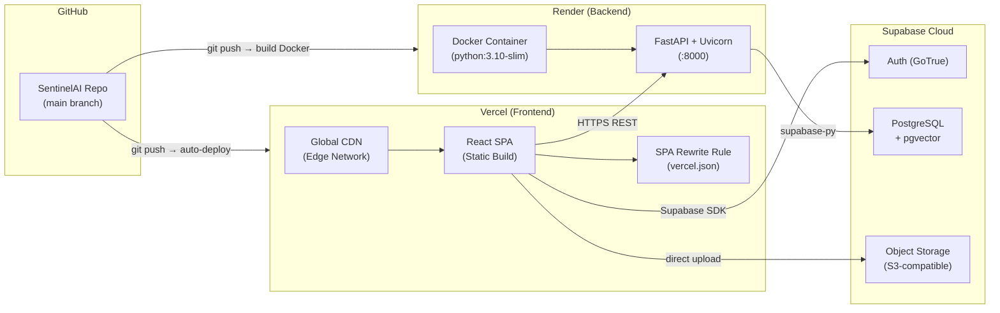

### Environment-specific configuration

| Setting | Local Dev | Production |
|---|---|---|
| `VITE_API_URL` | `http://localhost:8000` | `https://your-backend.onrender.com` |
| CORS origins | `localhost:5173` | Vercel app URLs |
| Uvicorn host | `127.0.0.1` | `0.0.0.0` (Docker) |
| Supabase keys | Development project | Production project |

---

## 🗺️ Future Roadmap

```mermaid
gantt
    title SentinelAI Development Roadmap
    dateFormat YYYY-Q
    axisFormat %Y Q%q

    section Phase 1 — Core (✅ Complete)
    Multi-agent pipeline         : done, p1a, 2025-Q4, 2026-Q1
    RAG + Copilot                : done, p1b, 2026-Q1, 2026-Q1
    HITL Approvals               : done, p1c, 2026-Q1, 2026-Q2
    Explainability Dashboard     : done, p1d, 2026-Q1, 2026-Q2
    MCP Tool Servers             : done, p1e, 2026-Q2, 2026-Q2

    section Phase 2 — Enhancement
    Live CCTV stream analysis    : active, p2a, 2026-Q3, 2026-Q3
    Audio pipeline in main UI    : p2b, 2026-Q3, 2026-Q3
    GPU-accelerated inference    : p2c, 2026-Q3, 2026-Q4
    Multi-language SOP support   : p2d, 2026-Q4, 2026-Q4

    section Phase 3 — Scale
    OSHA / ISO rule libraries    : p3a, 2026-Q4, 2027-Q1
    Slack / email notifications  : p3b, 2027-Q1, 2027-Q1
    Multi-zone trend analytics   : p3c, 2027-Q1, 2027-Q2
    Role-based access control    : p3d, 2027-Q2, 2027-Q2
```

| Priority | Feature | Detail |
|---|---|---|
| 🔴 High | **Live stream analysis** | Real-time CCTV feed processing via WebRTC or RTSP |
| 🔴 High | **Audio pipeline UI** | Wire Whisper transcription into the main analysis interface |
| 🔴 High | **GPU inference** | GPU-accelerated YOLOv8 on cloud GPU instances |
| 🟡 Medium | **Multi-language SOPs** | LLM translation layer for non-English SOP documents |
| 🟡 Medium | **Notifications** | Email + Slack alerts for critical violations in real-time |
| 🟡 Medium | **Zone trend analytics** | Cross-session violation trends per zone and per shift |
| 🟡 Medium | **OSHA/ISO templates** | Built-in standard rule library as default SOP baseline |
| 🟢 Low | **Mobile PWA** | Tablet-optimized interface for field compliance officers |
| 🟢 Low | **CSV/Excel export** | Data export for external reporting tools |
| 🟢 Low | **RBAC** | Admin / officer / viewer permission tiers |

---

## 📺 Screenshots

### Interactive Walkthrough Tour
*Click the "How It Works" button on the sign-in screen for the animated pipeline tour.*

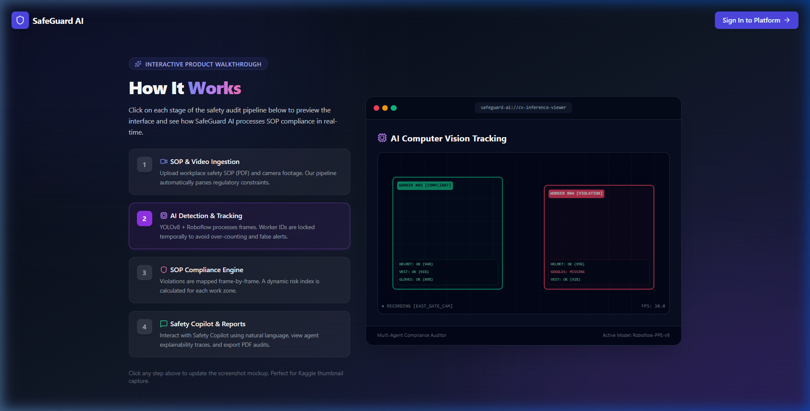

---

## 📜 License

This project is licensed under the [MIT License](LICENSE).

```
MIT License — Copyright (c) 2026 SentinelAI Contributors

Permission is hereby granted, free of charge, to any person obtaining a copy
of this software and associated documentation files (the "Software"), to deal
in the Software without restriction, including without limitation the rights
to use, copy, modify, merge, publish, distribute, sublicense, and/or sell
copies of the Software, and to permit persons to whom the Software is
furnished to do so, subject to the following conditions: [...]
```

---

<div align="center">

**Built with ❤️ for safer workplaces**

*SentinelAI — Where computer vision meets safety intelligence*

[⭐ Star this repo](https://github.com/aasthaj357/SentinelAI-Safety-Intelligence-Platform) · [🐛 Report a bug](https://github.com/aasthaj357/SentinelAI-Safety-Intelligence-Platform/issues) · [💡 Request a feature](https://github.com/aasthaj357/SentinelAI-Safety-Intelligence-Platform/issues)

</div>
