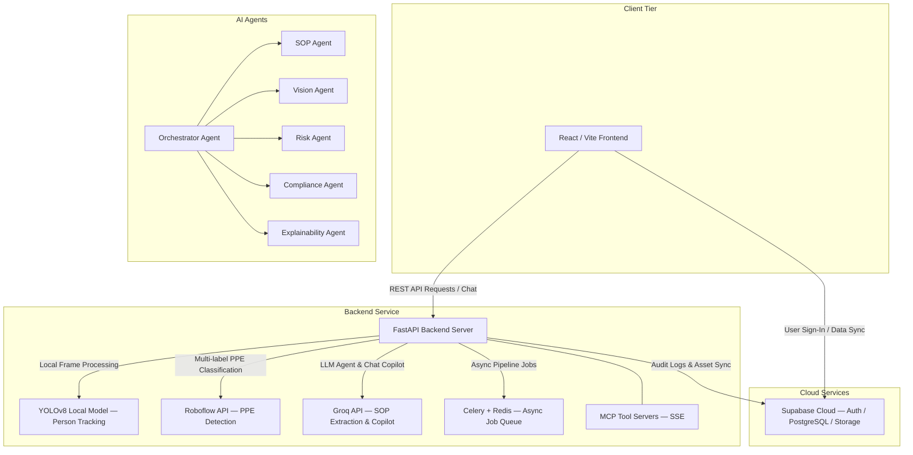

# SentinelAI — Workplace Safety & Compliance Intelligence Platform

SentinelAI is an enterprise-grade AI safety intelligence platform that automates workplace PPE audit compliance and risk assessment using a **multi-agent computer vision and LLM reasoning pipeline**.

By combining real-time CCTV / camera feed analysis (YOLOv8 + Roboflow) with LLM-parsed Standard Operating Procedures (SOPs via Groq), the platform continuously audits work zones, assigns persistent tracking identities to workers, calculates localized risk scores, and hosts an interactive safety copilot for compliance officers.

---

## 🚀 Features

- **SOP Document Ingestion**: Drag-and-drop PDF SOPs are parsed by a document ingestion agent, extracting required PPE types by zone, role, or activity and storing them in a vector knowledge base for RAG retrieval.
- **Persistent Temporal Worker Tracking**: Custom centroid-fallback + IoU temporal tracking resolves the "id-switching" problem, maintaining consistent worker identities (e.g., Worker #01, Worker #02) across occlusion and camera frame entries.
- **Multi-Label PPE Detection**: Detects helmets, goggles, high-visibility vests, gloves, masks, and safety shoes in real-time via a Roboflow custom model.
- **SOP Compliance Audit & Risk Engine**: Automatically maps frame-by-frame PPE detections to SOP constraints, tracking duration of violations and calculating a dynamic workspace risk index.
- **Safety Copilot AI & Decision Traces**: Interactive natural language copilot backed by LLM reasoning (Groq / Llama-3) allowing compliance officers to query safety exceptions with RAG-sourced citations.
- **Human-in-the-Loop (HITL) Approvals**: Compliance officers can review AI-flagged safety alerts, approve or reject them, and add contextual notes — creating an auditable approval workflow.
- **Explainability Dashboard**: Every risk score is decomposed into contributing factors with confidence scores, giving officers full transparency into AI decisions.
- **Agent Activity Monitor**: Real-time view of all active AI agents (SOP Agent, Vision Agent, Risk Agent, Compliance Agent, Explainability Agent, Orchestrator) with status, inputs, and outputs.
- **Evidence Gallery**: Timestamped frame-level evidence browser linked to specific violations and worker tracking identities.
- **Automated PDF Audit Reports**: Generates publication-ready compliance reports with violation summaries, risk matrices, and SOP alignment tables.
- **MCP Tool Servers**: Five Model Context Protocol (MCP) servers expose platform data and AI reasoning as callable tools for external integrations.
- **Interactive Walkthrough Tour**: Built-in animated pipeline tour on the sign-in screen for first-time users.

---

## 🏗️ Architecture

The platform follows a modern full-stack decoupled architecture:



---

## 🛠️ Tech Stack

### Frontend
| Technology | Role |
|---|---|
| React.js v19 (Vite) | UI Framework |
| Tailwind CSS | Styling & glassmorphic utilities |
| Lucide React | Icon system |
| Axios | HTTP client |
| Supabase JS | Auth & realtime |
| Vercel | Hosting |

### Backend
| Technology | Role |
|---|---|
| FastAPI (Python 3.10+) | API Framework |
| YOLOv8 (Ultralytics) | Local person detection |
| Roboflow Inference SDK | Multi-label PPE classification |
| Groq SDK (Llama-3-70b / 8b) | LLM reasoning & copilot |
| Sentence Transformers | RAG embeddings |
| Celery + Redis | Async video pipeline job queue |
| ReportLab / fpdf2 | PDF report generation |
| PyMuPDF | PDF SOP parsing |
| LangChain Text Splitters | Document chunking for RAG |
| MCP (SSE) | Tool server protocol |
| Render | Hosting |

### Database & Security
| Technology | Role |
|---|---|
| Supabase Auth | Authentication & JWT |
| PostgreSQL (Supabase Cloud) | Primary database |
| Supabase Storage | Video & document uploads |
| Row-Level Security (RLS) | Data isolation per user |

---

## 📂 Project Structure

```
.
├── backend/
│   ├── app/
│   │   ├── agents/         # AI agents (Orchestrator, SOP, Vision, Risk, Compliance, Explainability)
│   │   ├── api/            # REST API endpoints (dashboard, upload, analysis, chat, reports, approvals, audit, demo)
│   │   ├── core/           # Configuration, Supabase client, Celery app
│   │   ├── mcp/            # MCP SSE tool servers (SOP, Incident, Evidence, Reporting, Memory)
│   │   ├── models/         # Pydantic schemas
│   │   ├── services/       # AI pipeline, tracking, PDF generation, RAG, risk scoring
│   │   └── main.py         # Application entry point & middleware
│   ├── scripts/            # Development & diagnostic utilities (DB checks, endpoint tests)
│   ├── requirements.txt    # Python dependencies
│   ├── .env.example        # Environment variable template
│   ├── Dockerfile          # Container configuration
│   └── yolov8n.pt          # Local person detection model weights
├── frontend/
│   ├── src/
│   │   ├── components/     # Shared UI components (ProtectedRoute, etc.)
│   │   ├── context/        # React global state (Auth, ActiveProject)
│   │   ├── lib/            # Supabase client, auth helpers, constants
│   │   ├── pages/          # Core pages (Dashboard, Auth, Uploads, Evidence, Copilot, Agents, Approvals, Explainability, Audit)
│   │   └── App.jsx         # Client-side routing & sidebar
│   ├── public/             # Static assets (favicon, walkthrough screenshot)
│   ├── index.html          # HTML entry
│   ├── .env.example        # Frontend env variable template
│   ├── package.json        # Frontend dependencies
│   └── tailwind.config.js  # Styling configuration
├── supabase/
│   └── migrations/         # PostgreSQL schema definitions (12 migrations)
├── LICENSE                 # MIT License
├── render.yaml             # Render deployment blueprint
├── vercel.json             # Vercel SPA routing configuration
├── .gitignore              # Global git exclusions
└── README.md               # Project documentation
```

---

## ⚙️ Environment Variables

### Backend (`backend/.env`)
Copy `backend/.env.example` to `backend/.env` and fill in your values:

```env
# Supabase
SUPABASE_URL=https://your-project.supabase.co
SUPABASE_SECRET_KEY=your-supabase-service-role-key

# AI / Inference APIs
GROQ_API_KEY=gsk_your-groq-key
ROBOFLOW_API_KEY=your-roboflow-key

# Optional: Google Gemini
GEMINI_API_KEY=your-gemini-key
```

### Frontend (`frontend/.env`)
Copy `frontend/.env.example` to `frontend/.env` and fill in your values:

```env
VITE_SUPABASE_URL=https://your-project.supabase.co
VITE_SUPABASE_PUBLISHABLE_KEY=your-supabase-anon-key
VITE_API_URL=http://localhost:8000
```

> **Security note**: Never commit `.env` files. Both are listed in `.gitignore`.

---

## 🚀 Setup & Installation

### Prerequisites
- Python 3.10+
- Node.js 18+
- A [Supabase](https://supabase.com) account (free tier is sufficient)
- A [Groq](https://console.groq.com) API key (free)
- A [Roboflow](https://roboflow.com) API key (free tier)

### 1. Database Setup (Supabase)
1. Create a new Supabase project.
2. Open the **SQL Editor** and run each migration file in order from `supabase/migrations/` (start with `00000000000000_initial_schema.sql` through `00000000000011_fix_rls_and_service_role.sql`).
3. Go to **Project Settings → API** to get your `URL`, `anon` key, and `service_role` key.

### 2. Backend Setup
```bash
cd backend

# Create and activate virtual environment
python -m venv venv
# Windows:
.\venv\Scripts\activate
# macOS/Linux:
source venv/bin/activate

# Install dependencies
pip install -r requirements.txt

# Configure environment
cp .env.example .env
# Edit .env with your real keys

# Start the development server
uvicorn app.main:app --host 127.0.0.1 --port 8000 --reload
```

The API will be available at `http://localhost:8000`. Visit `http://localhost:8000/docs` for the interactive Swagger UI.

### 3. Frontend Setup
```bash
cd frontend

# Install dependencies
npm install

# Configure environment
cp .env.example .env
# Edit .env with your Supabase anon key and API URL

# Start the development server
npm run dev
```

Open `http://localhost:5173` in your browser.

---

## 🤖 AI Pipeline Overview

The video analysis pipeline executes the following stages in sequence:

1. **SOP Ingestion (SOP Agent)**: Reads uploaded PDF SOPs using Groq LLM, extracts structured JSON PPE requirements by zone and activity, and stores them in the vector knowledge base (PostgreSQL + sentence-transformer embeddings).

2. **Person Detection (Vision Agent / YOLOv8)**: Runs a local YOLOv8n model on each video frame to detect and localize all persons present.

3. **Temporal Identity Tracking (Temporal Tracker)**: Matches detected bounding boxes across frames using IoU (threshold: `0.4`) with centroid-distance fallback, maintaining persistent worker IDs across occlusion. Tracks pruned after 8 frames of absence.

4. **PPE Classification (Roboflow)**: Each worker's bounding box is cropped and submitted to a Roboflow custom multi-label PPE detection model. Returns confidence-scored labels for each PPE item.

5. **SOP Compliance Audit (Compliance Agent)**: RAG-retrieved SOP requirements are matched against per-worker PPE detections. Non-compliant durations are accumulated; structured violation records are persisted to the database.

6. **Risk Scoring (Risk Agent)**: A dynamic risk index is computed per worker and per workspace zone, factoring in violation severity, duration, and SOP coverage.

7. **Explainability (Explainability Agent)**: Each risk score is decomposed into contributing factors with confidence scores and human-readable rationale, queryable via the Copilot.

8. **Report Generation**: ReportLab generates a structured PDF compliance report aggregating all findings.

9. **MCP Tool Servers**: Five SSE-based MCP servers expose pipeline data (SOPs, incidents, evidence, reports, memory) as callable tools for external AI integrations.

---

## 📺 Screenshots & Demo

### Interactive Walkthrough Tour
*Click the "How It Works" button on the sign-in screen to view the animated pipeline tour.*


---

## 🚢 Deployment

### Frontend (Vercel)
1. Connect your GitHub repository to [Vercel](https://vercel.com).
2. Set the **Root Directory** to `frontend/`.
3. Add environment variables: `VITE_SUPABASE_URL`, `VITE_SUPABASE_PUBLISHABLE_KEY`, `VITE_API_URL`.

### Backend (Render)
The project includes a `render.yaml` blueprint:
1. Connect your GitHub repository to [Render](https://render.com).
2. Render will auto-detect `render.yaml` and deploy using `backend/Dockerfile`.
3. Add the backend environment variables in the Render dashboard.

---

## 📜 License

This project is licensed under the [MIT License](LICENSE).
